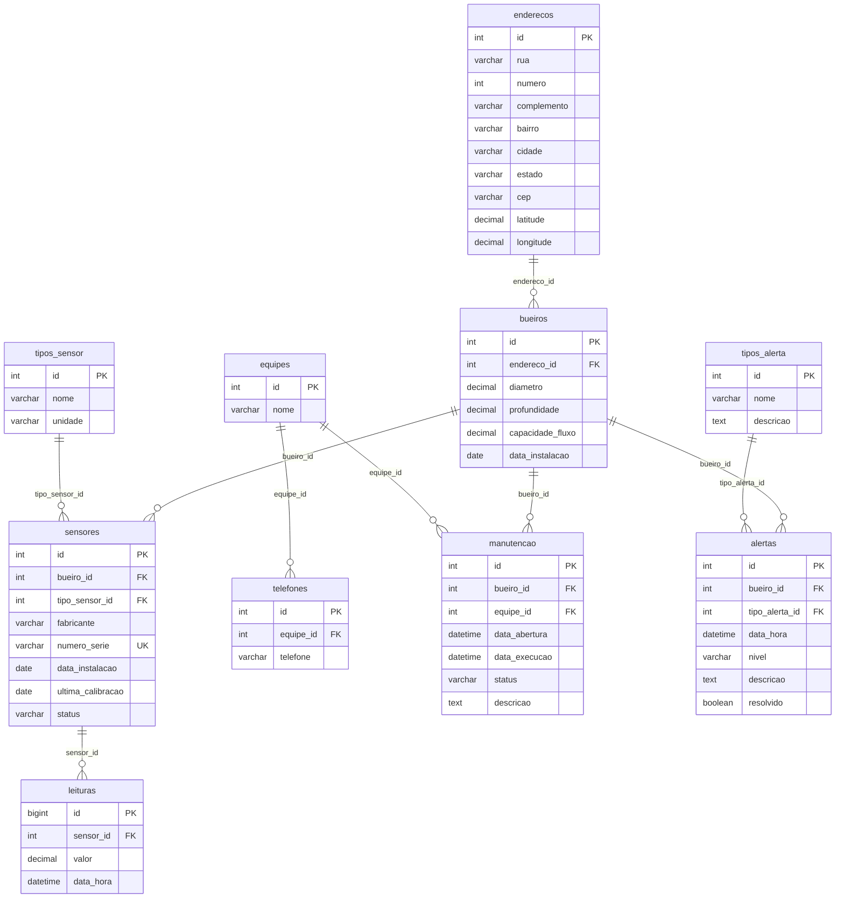

# FOSSUS

Projeto final da disciplina **Banco de Dados I** — Faculdades Doctum de Caratinga, Curso de Ciência da Computação, 5º período, 1º semestre de 2026. Professor: M.Sc. Elias Gonçalves.

**Integrantes:** Igor Lucas Viana Miranda, Mario Motta Neto, Ricardo Costa de Souza Melo e Yuri Mohandas Machado Secundino

## 1. Contexto e cenário

A Secretaria de Infraestrutura Urbana de Caratinga enfrenta alagamentos repentinos nas zonas de escoamento central da cidade. O projeto simula uma rede de **bueiros instrumentados com sensores IoT**, cada um monitorando três variáveis em tempo real:

- percentual de obstrução por sedimentos e lixo (0% a 100%);
- índice pluviométrico instantâneo (mm);
- volume de vazão das galerias subterrâneas (L/s).

O sistema precisa (1) modelar um banco relacional normalizado e com integridade referencial, (2) consolidar essas leituras em consultas analíticas e (3) expor tudo isso em um painel de monitoramento em tempo real para apoiar a equipe de engenharia do município na tomada de decisão.

O `Fossus` é o ecossistema construído para resolver isso: um banco MySQL modelado em Prisma, uma API REST em Express e um dashboard em Next.js com mapa interativo, alertas e gráficos por bueiro.

## 2. Decisões técnicas

- **Monorepo (Turborepo + npm workspaces)** — backend, frontend e banco de dados vivem no mesmo repositório, compartilhando tipos (`packages/api-types`) e componentes de UI (`packages/ui`) para evitar duplicação entre o que a API retorna e o que o front consome.
- **MySQL via Prisma** — exigido pelo enunciado (chaves estrangeiras, `ON DELETE CASCADE`, tipos numéricos otimizados). Prisma foi usado como camada de acesso e fonte única do schema (`packages/db/prisma/schema/schema.prisma`), mas o DDL puro também foi gerado e versionado como artefato de migração (ver seção 4.5).
- **`DECIMAL` em vez de `FLOAT`/`DOUBLE`** para coordenadas geográficas (`latitude DECIMAL(10,8)`, `longitude DECIMAL(11,8)`) e métricas de sensores (`valor DECIMAL(10,2)`, `capacidade_fluxo DECIMAL(10,2)` etc.). Tipos de ponto flutuante binário introduzem erro de arredondamento; `DECIMAL` garante precisão exata, importante tanto para georreferenciamento quanto para leituras que alimentam alertas críticos.
- **`leituras.id` como `BIGINT`** — é a tabela de maior volume (ingestão contínua de sensores), então o espaço de chaves de um `INT` se esgotaria mais rápido.
- **`ON DELETE CASCADE` nas relações de composição** (`enderecos → bueiros → sensores → leituras`, `bueiros → alertas`, `bueiros → manutencao`, `equipes → telefones`): essas entidades não fazem sentido sem o "pai" (um sensor não existe sem um bueiro, uma leitura não existe sem um sensor). Já as tabelas de domínio/lookup (`tipos_sensor`, `tipos_alerta`, `equipes`) usam `ON DELETE RESTRICT` ou `SET NULL` para não apagar histórico em cascata por engano ao remover um tipo ou uma equipe.
- **Tabelas de tipo/domínio separadas** (`tipos_sensor`, `tipos_alerta`) em vez de colunas `ENUM`/string livre nas tabelas principais — permite adicionar novos tipos de sensor/alerta sem alterar schema e evita redundância da unidade de medida (`tipos_sensor.unidade`) repetida em cada sensor.
- **Zod** para validação de payload tanto no backend (`apps/server/src/schemas`) quanto no frontend (`apps/web/src/schemas`), compartilhando o mesmo formato de dados descrito em `packages/api-types`.
- **Server Actions do Next.js** (`apps/web/src/actions`) como camada intermediária entre os componentes React e a API Express, em vez de chamadas diretas do client — centraliza tratamento de erro e tipagem de resposta (`lib/action-result.ts`).
- **Simulador de leituras com passeio aleatório** (`packages/db/scripts/simulate-leituras.ts`) — em vez de gerar cada leitura de forma totalmente independente, o valor de cada sensor varia a partir do último valor gerado (dentro de uma faixa por tipo de sensor), o que produz uma série temporal mais parecida com um sensor real do que ruído puro.
- **Agregação por bairro feita no client** (`apps/web/src/components/bairros-status-chart.tsx`) — a página inicial já busca a lista completa de bueiros (`GET /api/bueiros`) para desenhar o mapa; o gráfico por bairro reaproveita esses mesmos dados e agrupa por `endereco.bairro` no navegador, evitando um endpoint dedicado para uma agregação que já está disponível em memória.

## 3. Estrutura do repositório

```
fossus/
├── apps/
│   ├── web/                       # Dashboard (Next.js)
│   │   └── src/
│   │       ├── app/                # Rotas: mapa (/), detalhes do bueiro (/bueiros/[id]), equipes (/equipes)
│   │       ├── components/         # Mapa, tabelas, dialogs de CRUD, gráficos do dashboard
│   │       ├── actions/            # Server actions que chamam a API
│   │       └── schemas/            # Validação Zod no client
│   └── server/                    # API REST (Express)
│       └── src/
│           ├── routes/             # Definição dos endpoints por recurso
│           ├── controllers/        # Parsing de request/response
│           ├── services/           # Regras de negócio e queries Prisma
│           └── schemas/            # Validação Zod no servidor
├── packages/
│   ├── db/                        # Schema, migrações e seed do banco — ver seção 4.5
│   ├── api-types/                 # Tipos TypeScript compartilhados entre API e dashboard
│   ├── ui/                        # Componentes shadcn/ui reutilizáveis
│   ├── env/                       # Validação de variáveis de ambiente
│   └── config/                    # Configuração compartilhada (lint/format/tsconfig)
```

---

## 4. Fase 1 — Concepção do banco de dados

### 4.1 Diagrama Entidade-Relacionamento (DER)



O modelo é composto por 10 entidades:

- **`enderecos`** — localização física completa (rua, número, complemento, bairro, cidade, UF, CEP, latitude/longitude) onde um bueiro está instalado.
- **`bueiros`** — o ativo físico monitorado (diâmetro, profundidade, capacidade de vazão de projeto).
- **`tipos_sensor`** — domínio dos tipos de sensor existentes e sua unidade de medida (chuva/mm, vazão/L·s⁻¹, sedimento/cm, nível da água/cm).
- **`sensores`** — equipamento físico instalado em um bueiro, de um tipo específico.
- **`leituras`** — série temporal de valores emitidos por um sensor (tabela de maior volume, alimentada continuamente).
- **`tipos_alerta`** — domínio dos tipos de alerta (obstrução, alagamento, vazão baixa, sensor offline).
- **`alertas`** — ocorrência de alerta associada a um bueiro, opcionalmente tipada.
- **`equipes`** — equipes de manutenção do município.
- **`telefones`** — contatos telefônicos de uma equipe (1:N, pois uma equipe pode ter mais de um telefone).
- **`manutencao`** — ordem de serviço aberta para um bueiro e atribuída a uma equipe.

Cardinalidades principais: `enderecos (1) — (1) bueiros`, `bueiros (1) — (N) sensores`, `sensores (1) — (N) leituras`, `bueiros (1) — (N) alertas`, `bueiros (1) — (N) manutencao`, `equipes (1) — (N) manutencao`, `equipes (1) — (N) telefones`, `tipos_sensor (1) — (N) sensores`, `tipos_alerta (1) — (N) alertas`.

### 4.2 Dicionário de dados

**enderecos**

| Coluna      | Tipo                | Regras                                                 |
| ----------- | ------------------- | ------------------------------------------------------ |
| id          | INT, AUTO_INCREMENT | PK                                                     |
| rua         | VARCHAR(100)        | NOT NULL                                               |
| numero      | INT                 | —                                                      |
| complemento | VARCHAR(100)        | — (ex.: "Em frente à praça", "Estacionamento externo") |
| bairro      | VARCHAR(100)        | —                                                      |
| cidade      | VARCHAR(100)        | NOT NULL, DEFAULT `'Caratinga'`                        |
| estado      | VARCHAR(2)          | NOT NULL, DEFAULT `'MG'` (UF)                          |
| cep         | VARCHAR(10)         | —                                                      |
| latitude    | DECIMAL(10,8)       | —                                                      |
| longitude   | DECIMAL(11,8)       | —                                                      |

**bueiros**

| Coluna           | Tipo                | Regras                                             |
| ---------------- | ------------------- | -------------------------------------------------- |
| id               | INT, AUTO_INCREMENT | PK                                                 |
| endereco_id      | INT                 | NOT NULL, FK → `enderecos.id`, `ON DELETE CASCADE` |
| diametro         | DECIMAL(6,2)        | cm                                                 |
| profundidade     | DECIMAL(6,2)        | cm                                                 |
| capacidade_fluxo | DECIMAL(10,2)       | L/s                                                |
| data_instalacao  | DATE                | —                                                  |

**tipos_sensor**

| Coluna  | Tipo                | Regras                                                         |
| ------- | ------------------- | -------------------------------------------------------------- |
| id      | INT, AUTO_INCREMENT | PK                                                             |
| nome    | VARCHAR(50)         | NOT NULL (ex.: "Chuva", "Vazão", "Sedimento", "Nível da Água") |
| unidade | VARCHAR(20)         | NOT NULL (ex.: "mm", "L/s", "cm")                              |

**sensores**

| Coluna            | Tipo                | Regras                                                 |
| ----------------- | ------------------- | ------------------------------------------------------ |
| id                | INT, AUTO_INCREMENT | PK                                                     |
| bueiro_id         | INT                 | NOT NULL, FK → `bueiros.id`, `ON DELETE CASCADE`       |
| tipo_sensor_id    | INT                 | NOT NULL, FK → `tipos_sensor.id`, `ON DELETE RESTRICT` |
| fabricante        | VARCHAR(100)        | —                                                      |
| numero_serie      | VARCHAR(100)        | UNIQUE                                                 |
| data_instalacao   | DATE                | —                                                      |
| ultima_calibracao | DATE                | —                                                      |
| status            | VARCHAR(30)         | `ATIVO` \| `INATIVO` \| `MANUTENCAO`                   |

**leituras**

| Coluna    | Tipo                   | Regras                                            |
| --------- | ---------------------- | ------------------------------------------------- |
| id        | BIGINT, AUTO_INCREMENT | PK                                                |
| sensor_id | INT                    | NOT NULL, FK → `sensores.id`, `ON DELETE CASCADE` |
| valor     | DECIMAL(10,2)          | NOT NULL                                          |
| data_hora | DATETIME               | NOT NULL                                          |

**equipes**

| Coluna | Tipo                | Regras   |
| ------ | ------------------- | -------- |
| id     | INT, AUTO_INCREMENT | PK       |
| nome   | VARCHAR(100)        | NOT NULL |

**telefones**

| Coluna    | Tipo                | Regras                                           |
| --------- | ------------------- | ------------------------------------------------ |
| id        | INT, AUTO_INCREMENT | PK                                               |
| equipe_id | INT                 | NOT NULL, FK → `equipes.id`, `ON DELETE CASCADE` |
| telefone  | VARCHAR(20)         | —                                                |

**manutencao**

| Coluna        | Tipo                | Regras                                                   |
| ------------- | ------------------- | -------------------------------------------------------- |
| id            | INT, AUTO_INCREMENT | PK                                                       |
| bueiro_id     | INT                 | NOT NULL, FK → `bueiros.id`, `ON DELETE CASCADE`         |
| equipe_id     | INT                 | NOT NULL, FK → `equipes.id`, `ON DELETE RESTRICT`        |
| data_abertura | DATETIME            | —                                                        |
| data_execucao | DATETIME            | —                                                        |
| status        | VARCHAR(30)         | `ABERTA` \| `EM_ANDAMENTO` \| `CONCLUIDA` \| `CANCELADA` |
| descricao     | TEXT                | —                                                        |

**tipos_alerta**

| Coluna    | Tipo                | Regras                                                                     |
| --------- | ------------------- | -------------------------------------------------------------------------- |
| id        | INT, AUTO_INCREMENT | PK                                                                         |
| nome      | VARCHAR(50)         | NOT NULL (ex.: "OBSTRUÇÃO", "ALAGAMENTO", "VAZÃO_BAIXA", "SENSOR_OFFLINE") |
| descricao | TEXT                | —                                                                          |

**alertas**

| Coluna         | Tipo                | Regras                                           |
| -------------- | ------------------- | ------------------------------------------------ |
| id             | INT, AUTO_INCREMENT | PK                                               |
| bueiro_id      | INT                 | NOT NULL, FK → `bueiros.id`, `ON DELETE CASCADE` |
| tipo_alerta_id | INT                 | FK → `tipos_alerta.id`, `ON DELETE SET NULL`     |
| data_hora      | DATETIME            | NOT NULL                                         |
| nivel          | VARCHAR(20)         | `BAIXO` \| `MEDIO` \| `ALTO` \| `CRITICO`        |
| descricao      | TEXT                | —                                                |
| resolvido      | BOOLEAN             | DEFAULT `FALSE`                                  |

### 4.3 Validação das formas normais

- **1FN** — todos os atributos são atômicos e não há grupos repetitivos. Os telefones de uma equipe não foram modelados como uma coluna `telefones` separada por vírgula em `equipes`; viraram a tabela `telefones` (1:N). Da mesma forma, o tipo de sensor/alerta não é uma string livre repetida em cada linha, e sim uma referência a `tipos_sensor`/`tipos_alerta`.
- **2FN** — todas as tabelas usam chave primária simples (`id` substituto, sem chaves compostas), logo não existe dependência parcial possível: cada atributo não-chave depende da totalidade da chave primária.
- **3FN** — nenhum atributo não-chave depende de outro atributo não-chave (dependência transitiva). Exemplos de decisões tomadas especificamente para isso:
  - `unidade` (mm, L/s, cm) é um atributo de `tipos_sensor`, não de `sensores` nem de `leituras` — caso contrário, a unidade dependeria do tipo do sensor, e não da chave primária da tabela onde estivesse armazenada.
  - `enderecos` foi extraída de `bueiros` — rua/CEP/coordenadas descrevem o local, não o bueiro em si; isso também evita repetição caso, futuramente, mais de um ativo compartilhe o mesmo endereço.
  - `alertas.descricao` (texto do incidente específico) é independente de `tipos_alerta.descricao` (texto genérico do tipo de alerta) — não há sobreposição/redundância entre os dois níveis.

`cidade`/`estado` foram mantidos como atributos diretos de `enderecos` (com valores padrão `'Caratinga'`/`'MG'`), e não extraídos para uma tabela `cidades` à parte: o cenário do enunciado é restrito a um único município, então essa normalização adicional não eliminaria nenhuma redundância real nos dados — seria uma tabela com uma única linha.

### 4.4 Álgebra relacional → SQL das visões analíticas

As expressões abaixo correspondem às consultas analíticas que a API e o dashboard realmente executam (ver `apps/server/src/services`). Notação: $\pi$ projeção, $\sigma$ seleção, $\bowtie$ junção natural/equi-junção (e $\bowtie_{L}$ para junção externa à esquerda, LEFT OUTER JOIN), $\gamma$ agrupamento/agregação no formato $\gamma_{\text{atributos}\,;\ \text{agregações} \to \text{alias}}$.

**1. Bueiros com alerta crítico não resolvido** (alimenta o contador "Críticos" do mapa e o status do bueiro — `apps/server/src/services/bueiros.ts`)

```math
\pi_{\text{bueiro\_id, rua, numero, nivel, descricao, data\_hora}} \Big(
  \sigma_{\text{resolvido = false} \,\land\, \text{nivel = 'CRITICO'}}(\text{Alertas})
  \;\bowtie_{\text{Alertas.bueiro\_id = Bueiros.id}}\; \text{Bueiros}
  \;\bowtie_{\text{Bueiros.endereco\_id = Enderecos.id}}\; \text{Enderecos}
\Big)
```

```sql
SELECT b.id AS bueiro_id, e.rua, e.numero, a.nivel, a.descricao, a.data_hora
FROM alertas a
JOIN bueiros b ON b.id = a.bueiro_id
JOIN enderecos e ON e.id = b.endereco_id
WHERE a.resolvido = FALSE AND a.nivel = 'CRITICO'
ORDER BY a.data_hora DESC;
```

**2. Contagem de bueiros por status (normal / atenção / crítico)** (cards "Normais / Alertas / Críticos" da página inicial)

```math
\begin{aligned}
\text{StatusPorBueiro} &= \gamma_{\text{bueiro\_id}\,;\ \text{COUNT}(\sigma_{\text{resolvido=false} \,\land\, \text{nivel='CRITICO'}}(\text{Alertas})) \to \text{criticos},\ \text{COUNT}(\sigma_{\text{resolvido=false}}(\text{Alertas})) \to \text{ativos}}\big(\text{Bueiros} \;\bowtie_{L}\; \text{Alertas}\big) \\
\text{Resultado} &= \gamma_{\text{status}\,;\ \text{COUNT}(*) \to \text{total}}\big(\pi_{\text{status}}(\text{StatusPorBueiro})\big)
\end{aligned}
```

```sql
SELECT status, COUNT(*) AS total
FROM (
  SELECT
    b.id,
    CASE
      WHEN SUM(CASE WHEN a.resolvido = FALSE AND a.nivel = 'CRITICO' THEN 1 ELSE 0 END) > 0 THEN 'critical'
      WHEN SUM(CASE WHEN a.resolvido = FALSE THEN 1 ELSE 0 END) > 0 THEN 'warning'
      ELSE 'normal'
    END AS status
  FROM bueiros b
  LEFT JOIN alertas a ON a.bueiro_id = b.id
  GROUP BY b.id
) AS bueiro_status
GROUP BY status;
```

**3. Alertas por tipo e por mês de um bueiro, últimos 6 meses** (gráfico de barras do dashboard — `getDashboard` em `apps/server/src/services/bueiros.ts`)

```math
\pi_{\text{tipo, mes, total}}\Big(
  \gamma_{\text{tipo, mes}\,;\ \text{COUNT}(*) \to \text{total}}\big(
    \sigma_{\text{bueiro\_id = :id} \,\land\, \text{data\_hora} \,\geq\, \text{:desde}}(\text{Alertas}) \;\bowtie\; \text{Tipos\_Alerta}
  \big)
\Big)
```

```sql
SELECT COALESCE(ta.nome, 'Outro') AS tipo,
       DATE_FORMAT(a.data_hora, '%Y-%m') AS mes,
       COUNT(*) AS total
FROM alertas a
LEFT JOIN tipos_alerta ta ON ta.id = a.tipo_alerta_id
WHERE a.bueiro_id = :bueiro_id AND a.data_hora >= :desde
GROUP BY tipo, mes
ORDER BY mes;
```

**4. Série histórica de leituras de um sensor** (telemetria bruta — `GET /api/leituras`)

```math
\pi_{\text{data\_hora, valor, tipo, unidade}}\Big(
  \sigma_{\text{sensor\_id = :id}}(\text{Leituras}) \;\bowtie\; \text{Sensores} \;\bowtie\; \text{Tipos\_Sensor}
\Big)
```

```sql
SELECT l.data_hora, l.valor, ts.nome AS tipo, ts.unidade
FROM leituras l
JOIN sensores s ON s.id = l.sensor_id
JOIN tipos_sensor ts ON ts.id = s.tipo_sensor_id
WHERE l.sensor_id = :sensor_id
ORDER BY l.data_hora;
```

**5. Manutenções em aberto por equipe** (carga de trabalho operacional — `apps/server/src/services/manutencao.ts`)

```math
\pi_{\text{equipe, total}}\Big(
  \gamma_{\text{equipe}\,;\ \text{COUNT}(*) \to \text{total}}\big(
    \sigma_{\text{status} \,\in\, \{\text{'ABERTA', 'EM\_ANDAMENTO'}\}}(\text{Manutencao}) \;\bowtie\; \text{Equipes}
  \big)
\Big)
```

```sql
SELECT eq.nome AS equipe, COUNT(*) AS total
FROM manutencao m
JOIN equipes eq ON eq.id = m.equipe_id
WHERE m.status IN ('ABERTA', 'EM_ANDAMENTO')
GROUP BY eq.nome
ORDER BY total DESC;
```

**6. Bueiros por status, consolidado por bairro** (gráfico de barras empilhadas da página inicial — `apps/web/src/components/bairros-status-chart.tsx`; no app a agregação é feita no client a partir do `GET /api/bueiros` já carregado para o mapa, mas a consulta abaixo é a forma equivalente de obtê-la direto do banco)

```math
\begin{aligned}
\text{StatusPorBueiro} &= \gamma_{\text{bueiro\_id, bairro}\,;\ \text{COUNT}(\sigma_{\text{resolvido=false} \,\land\, \text{nivel='CRITICO'}}(\text{Alertas})) \to \text{criticos},\ \text{COUNT}(\sigma_{\text{resolvido=false}}(\text{Alertas})) \to \text{ativos}}\big(\text{Bueiros} \;\bowtie\; \text{Enderecos} \;\bowtie_{L}\; \text{Alertas}\big) \\
\text{Resultado} &= \gamma_{\text{bairro, status}\,;\ \text{COUNT}(*) \to \text{total}}\big(\pi_{\text{bairro, status}}(\text{StatusPorBueiro})\big)
\end{aligned}
```

```sql
SELECT bairro, status, COUNT(*) AS total
FROM (
  SELECT
    b.id,
    e.bairro,
    CASE
      WHEN SUM(CASE WHEN a.resolvido = FALSE AND a.nivel = 'CRITICO' THEN 1 ELSE 0 END) > 0 THEN 'critical'
      WHEN SUM(CASE WHEN a.resolvido = FALSE THEN 1 ELSE 0 END) > 0 THEN 'warning'
      ELSE 'normal'
    END AS status
  FROM bueiros b
  JOIN enderecos e ON e.id = b.endereco_id
  LEFT JOIN alertas a ON a.bueiro_id = b.id
  GROUP BY b.id, e.bairro
) AS bueiro_status
GROUP BY bairro, status
ORDER BY bairro;
```

### 4.5 Scripts DDL

O schema é definido como fonte única em [`packages/db/prisma/schema/schema.prisma`](packages/db/prisma/schema/schema.prisma) (modelo Prisma) e versionado como **SQL puro** — testado no SGBD — na migração:

📄 [`packages/db/prisma/migrations/20260608224631_create_fossus_tables/migration.sql`](packages/db/prisma/migrations/20260608224631_create_fossus_tables/migration.sql) — `CREATE TABLE` de todas as 10 entidades (incluindo `complemento`/`bairro`/`cidade`/`estado` em `enderecos`, usados pela consulta da seção 4.4, item 6), chaves estrangeiras com `ON DELETE CASCADE`/`RESTRICT`/`SET NULL` e os índices de performance (`idx_leituras_sensor`, `idx_sensor_data`, `idx_alertas_bueiro`, `idx_alertas_data`, `idx_manutencao_bueiro`, `idx_sensores_bueiro`), pensados para acelerar exatamente as consultas analíticas da seção 4.4 (filtro por `sensor_id` + intervalo de tempo, filtro por `bueiro_id`, etc.).

Dados de carga inicial (massa de teste fictícia) estão em [`packages/db/prisma/seed.ts`](packages/db/prisma/seed.ts).

---

## 5. Fase 2 — Integração

### 5.1 API REST

Implementada em **Express** (`apps/server/src`), seguindo o padrão `routes → controllers → services` por entidade. Cada entidade tem validação de payload com **Zod** (`apps/server/src/schemas`) antes de chegar ao Prisma.

| Recurso         | Endpoints                                                                                                        | Arquivo                    |
| --------------- | ---------------------------------------------------------------------------------------------------------------- | -------------------------- |
| Bueiros         | `GET /api/bueiros`, `GET /:id`, `GET /:id/dashboard`, `POST`, `PUT /:id`, `DELETE /:id`                          | `routes/bueiros.ts`        |
| Sensores        | `GET /api/sensores`, `GET /bueiro/:bueiroId`, `GET /:id`, `POST`, `PUT /:id`, `DELETE /:id`                      | `routes/sensores.ts`       |
| Leituras        | `GET /api/leituras`, `POST /api/leituras`                                                                        | `routes/leituras.ts`       |
| Alertas         | `GET /api/alertas`, `GET /bueiro/:bueiroId`, `GET /:id`, `POST`, `PUT /:id`                                      | `routes/alertas.ts`        |
| Tipos de alerta | CRUD completo                                                                                                    | `routes/tipos-alerta.ts`   |
| Tipos de sensor | `GET /api/tipos-sensores`                                                                                        | `routes/tipos-sensores.ts` |
| Manutenção      | `GET /api/manutencoes`, `GET /bueiro/:bueiroId`, `GET /:id`, `POST /bueiro/:bueiroId`, `PUT /:id`, `DELETE /:id` | `routes/manutencao.ts`     |
| Equipes         | CRUD completo                                                                                                    | `routes/equipes.ts`        |

O endpoint `GET /api/bueiros/:id/dashboard` é o que materializa o cruzamento de dados (alertas × tempo × tipo, contagem de sensores/manutenções) descrito na seção 4.4, item 3, e devolve o JSON consumido diretamente pelo gráfico do dashboard.

Os tipos de request/response são compartilhados com o frontend via [`packages/api-types`](packages/api-types/src), evitando dessincronia entre o que a API retorna e o que o client espera.

### 5.2 Ingestão de dados dos sensores

A massa de dados é gerada de três formas:

1. **Carga inicial determinística** — [`packages/db/prisma/seed.ts`](packages/db/prisma/seed.ts) (`npm run db:seed`), que popula endereços, bueiros, sensores, leituras históricas, equipes, manutenções e alertas com cenários propositalmente variados (bueiros normais, em atenção e críticos).
2. **Inserção sob demanda** — `POST /api/leituras`, validado por `apps/server/src/schemas/leituras.ts`, que qualquer processo externo (ou um gerador de carga) pode chamar para simular uma nova leitura de sensor chegando.
3. **Simulador contínuo** — [`packages/db/scripts/simulate-leituras.ts`](packages/db/scripts/simulate-leituras.ts) (`npm run db:simulate`), um script Node/TypeScript que roda em loop e, a cada intervalo (`SIMULATE_INTERVAL_MS`, padrão 5000ms), gera uma nova leitura para cada sensor `ATIVO` direto via Prisma (sem passar pela API). O valor de cada sensor varia a partir do último valor gerado, dentro de uma faixa por tipo de sensor (chuva, vazão, sedimento, nível da água), simulando uma série temporal contínua em vez de ruído independente a cada leitura.

```bash
npm run db:simulate
# ou, para mudar a frequência:
SIMULATE_INTERVAL_MS=2000 npm run db:simulate
```

---

## 6. Fase 3 — Dashboard

Construído em **Next.js + Tailwind + shadcn/ui** (`apps/web`), consumindo a API via **TanStack Query** e Server Actions (`apps/web/src/actions`).

- **Mapa em tempo real** (`apps/web/src/app/page.tsx`) — todos os bueiros plotados por latitude/longitude, com contadores de "Normais / Alertas / Críticos" (consulta da seção 4.4, item 2) e marcadores coloridos por status; clicar em um marcador abre os detalhes do bueiro.
- **Gráfico de bueiros por bairro** (`components/bairros-status-chart.tsx`, também na página inicial) — gráfico de barras empilhadas (verde/âmbar/vermelho) consolidando, por bairro, quantos bueiros estão normais, em atenção ou críticos (consulta da seção 4.4, item 6). Reaproveita a mesma lista de bueiros já buscada para o mapa, agrupando por `endereco.bairro` no client.
- **Painel por bueiro** (`apps/web/src/app/bueiros/[id]/page.tsx`) com abas:
  - **Dashboard** (`components/bueiro-dashboard.tsx`) — cards de status/sensores/manutenções/alertas e gráfico de barras de alertas por tipo ao longo dos últimos 6 meses (consulta da seção 4.4, item 3), usando `recharts`.
  - **Sensores**, **Alertas**, **Manutenções** — tabelas com CRUD completo (`datatable/`).
- **Equipes** (`apps/web/src/app/equipes/page.tsx`) — CRUD de equipes de manutenção e seus telefones.

---

## 7. Como rodar localmente

### Requisitos

- [Docker](https://www.docker.com/) (para o MySQL)
- [Node.js](https://nodejs.org/)

### Passo a passo

1. Clone o repositório:

```bash
git clone https://github.com/RicardoCSM/fossus.git
```

2. Acesse a pasta do projeto:

```bash
cd fossus
```

3. Copie os arquivos de ambiente e configure as variáveis necessárias:

```bash
cp apps/server/.env.example apps/server/.env
cp apps/web/.env.example apps/web/.env
```

4. Instale as dependências:

```bash
npm install
```

5. Inicie o banco de dados via Docker:

```bash
npm run db:start
```

6. Execute as migrations para criar a estrutura do banco:

```bash
npm run db:migrate
```

7. (Opcional) Popule o banco com dados fictícios para já ter algo para visualizar no dashboard:

```bash
npm run db:seed
```

8. Inicie a aplicação:

```bash
npm run dev
```

9. (Opcional) Em outro terminal, inicie o simulador de leituras contínuas para ver o dashboard recebendo dados em tempo real:

```bash
npm run db:simulate
```

Após esses passos, a API estará disponível em [http://localhost:3000](http://localhost:3000) e o dashboard em [http://localhost:3001](http://localhost:3001).

As variáveis padrão já vêm prontas para desenvolvimento local em `apps/server/.env.example` (`DATABASE_URL` apontando para o MySQL do `docker-compose.yml`, `CORS_ORIGIN`) e `apps/web/.env.example` (`NEXT_PUBLIC_SERVER_URL`) — normalmente não é necessário alterar nada para rodar localmente.

## 8. Scripts disponíveis

- `npm run dev` — sobe API e dashboard em modo desenvolvimento
- `npm run dev:web` / `npm run dev:server` — sobe apenas um dos dois
- `npm run build` — build de produção de todos os apps
- `npm run check-types` — checagem de tipos TypeScript em todo o monorepo
- `npm run check` — Oxlint + Oxfmt
- `npm run db:start` / `db:stop` / `db:down` — controla o container MySQL
- `npm run db:push` — aplica o schema Prisma ao banco
- `npm run db:migrate` — gera/aplica uma migração versionada
- `npm run db:generate` — gera o client Prisma
- `npm run db:seed` — popula dados fictícios
- `npm run db:simulate` — inicia o simulador de leituras contínuas (`SIMULATE_INTERVAL_MS` para configurar o intervalo)
- `npm run db:studio` — abre o Prisma Studio (UI de inspeção do banco)

## 9. Aderência ao enunciado

| Item do enunciado                                       | Status | Onde está                                                                     |
| ------------------------------------------------------- | ------ | ----------------------------------------------------------------------------- |
| DER                                                     | ✅     | diagrama Mermaid na seção 4.1 do README                                       |
| Tipos de chave e dicionário de dados                    | ✅     | seção 4.2                                                                     |
| Validação 1FN/2FN/3FN                                   | ✅     | seção 4.3                                                                     |
| Álgebra relacional + SQL das visões analíticas          | ✅     | seção 4.4                                                                     |
| Scripts DDL testados no SGBD                            | ✅     | `packages/db/prisma/migrations/` (seção 4.5)                                  |
| Script de inserção contínua de leituras                 | ✅     | `packages/db/scripts/simulate-leituras.ts`, `npm run db:simulate` (seção 5.2) |
| Endpoints de API expondo tabelas e cruzamentos via JSON | ✅     | seção 5.1                                                                     |
| Interface visual alimentada pela API                    | ✅     | seção 6                                                                       |
| Painel com alertas de bueiros críticos                  | ✅     | mapa inicial + painel por bueiro (seção 6)                                    |
| Gráfico consolidando dados por bairros                  | ✅     | `bairros-status-chart.tsx` na página inicial (seção 6)                        |
